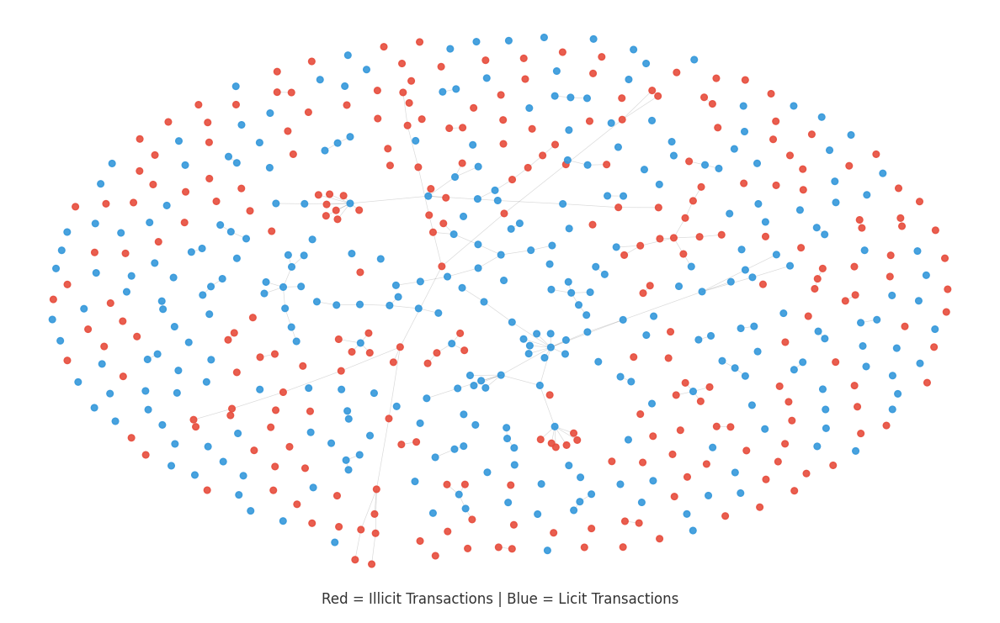

# 🪙 GraphFMD: Graph based Financial Misconduct Detection 

**GraphFMD** is a temporal graph learning benchmark for financial misconduct detection in the Bitcoin transaction network  
Participants must classify transactions as illicit (fraudulent) or licit (legitimate).

This repository is designed for **Human vs. LLM** task.

---




## 🏆 Leaderboard

View the real-time rankings here: **[https://faranbutt.github.io/GraphFMD/](https://faranbutt.github.io/GraphFMD/)**


## 🚀 How to Participate

To ensure the secrecy of the test labels and participant data, we use a **Secure Submission Portal**.

### Step 1: Prepare your Files
You must prepare two files:

1. **`predictions.csv`**: Must contain exactly two columns: `id` and `y_pred`.
   - `1`: Illicit (Fraudulent)
   - `2`: Licit (Legal)
2. **`metadata.json`**: A short description of your approach.

```json
{
  "team": "Your_Team_Name",
  "run_id": "run_01/run_02.... etc",
  "author_type": "human / llm / hybrid",
  "model": "GCN / GraphSAGE / etc.",
  "notes": "Briefly describe your layers/hyperparameters"
}


```

### Step 2: Upload to the Submission Portal
Submit your files via the official Google Form:  
👉 **[Official Submission Form](https://docs.google.com/forms/d/e/1FAIpQLSdyqFftCdnH3SAn6AFBVu3qUpG_MUXNSyRssUcw9RKqh9V-nw/viewform?usp=dialog)**

### Step 3: Automated Scoring
Once you submit the form:
* A **GitHub Action** is triggered automatically.
* Your model is scored against the **Hidden Ground Truth**.
* The **Leaderboard** is updated instantly.


## 1. Task Overview

* **Task:** Temporal Inductive Node Classification (Licit vs. Illicit).
* **Domain:** Cryptocurrency (Bitcoin) Forensics.
* **Target:** Predict the class label of each transaction (Illicit = 1, Licit = 2).
* **Metric:** **Macro-F1 across both classes (Illicit and Licit)**.  

## 2. The Data
* **Nodes (Node Feature Matrix (X)):** Bitcoin transactions.165 local and aggregate features. (Train =  16658 , Test = 8896)
* **Edges (adjacency matrix (A)) :** The flow of BTC between transactions.


## 3. Difficulty level:
- **Feature Noise** Gaussian noise was added to make the features simulate real world noisy data. 
- **Temporal Shifting:** Time-based split (Train: 1–34, Test: 35+)
-  **Class Imbalance & Graph Sparsity:** All illicit transactions are preserved while only 50% of licit transactions are retained (unknown nodes removed)


## 4. Submission Policy:
For maintaining fairness and competition competency
- One submission policy is enforced so you are only allowed to do one form submission


## 6. Submission Format

To enter the competition, you must submit a CSV file named exactly prediction.csv inside the submissions/ folder.

```csv
submissions/participant1/prediction.csv
id,y_pred
6418,1
7952,2
.....
.....
```
id: Transaction ID (must match test_nodes.csv).

y_pred: The predicted class label:

 1: Illicit (Fraudulent)
 2: Licit (Legal)


## 7. Automated Validation Checks:
When a Pull Request is opened the bot will
- Check identity (Verify if you have already submitted)
- Check Formats (Ensure your JSON and CSV files are structured properly)


## 8. Repository Structure

```text
.
├── data/
│   ├── public/            
│   │   ├── train_nodes.csv
│   │   ├── train_labels.csv
│   │   ├── test_nodes.csv
│   │   └── edgelist.csv
├── competition/
│   ├── baseline.py         # Starter GCN model
│   ├── evaluate.py         # Scoring logic
│   ├── metrics.py          # F1-Score calculation
│   └── update_leaderboard.py
├── submissions/            # Submission directory
│   └── participant1
│   │  └── predictions.csv
├── leaderboard/            # CSV/Markdown rankings
└── docs/                   # Interactive Leaderboard
└── images/                   
```

## 📝 Citation

If you use this challenge, dataset, or repository in your research, please cite:

```bibtex
@dataset{graphfmd_2026,
  title={GraphFMD: Graph-based Financial Misconduct Detection Benchmark},
  author={Faran Taimoor Butt},
  year={2026},
  url = {https://github.com/faranbutt/GraphFMD}
}
```


## 📚 References

### Learning Resources
* **[Basira Lab]** [Deep Graph Learning Playlist](https://www.youtube.com/watch?v=gQRV_jUyaDw&list=PLug43ldmRSo14Y_vt7S6vanPGh-JpHR7T) – Essential video tutorials for GNN fundamentals.
* **[Basira Lab]** [Deep Graph Learning GitHub](https://github.com/basiralab/DGL) – Codebase and implementations for graph-based models.
---

### Datasets

* **[1]** Elliptic, [www.elliptic.co](http://www.elliptic.co).
* **[2]** M. Weber, G. Domeniconi, J. Chen, D. K. I. Weidele, C. Bellei, T. Robinson, C. E. Leiserson, "Anti-Money Laundering in Bitcoin: Experimenting with Graph Convolutional Networks for Financial Forensics", KDD ’19 Workshop on Anomaly Detection in Finance, August 2019, Anchorage, AK, USA.

